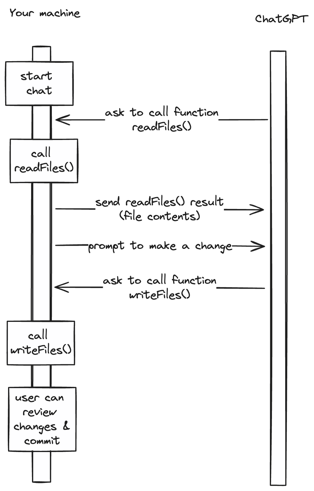

# chisel

Give ChatGPT direct access to read and write your application code

## Status

alpha/proof of concept

Currently this is only suitable for very small apps

## Quick Start

- `git clone https://github.com/martinpllu/chisel`
- `cd chisel`
- `npm install`
- Add a file `.env` containing:

```env
OPENAI_API_KEY=your_api_key_here
```

- Start via `npx tsx src/index.ts --directory=/path/to/your/app`
- `chisel` will start by sending the content of all files in the directory to chatgpt. 
  - Files in `src/read-files.ts#DEFAULT_IGNORE_PATHS` will be ignored, as will any glob paths passed as `--ignorePaths`
- Prompt the CLI to make a code change, e.g. `Improve the README` and `chisel` will change the required file(s)
- You can then review changes. If your application is managed with git you can review the diffs and commit.
- You can also ask `chisel` questions about the code.
- Press Ctri-C to quit.

## How does it work?

`chisel` uses ChatGPT's [function calling](https://platform.openai.com/docs/guides/function-calling) feature. Two functions are used:

- `readFiles` which reads all files in the supplied directory (the `--directory` argument), apart fromt he ignored files and returns their contents. 
- `writeFiles` which accepts a list of paths within the directory, and a corresponding list of file contents to write.



## Safety

`chisel` can only read and write files within the supplied directory. All ChatGPT-supplied paths are checked to ensure that they resolve to files which are actually within the directory.

## License

This project is open source and available under the ISC License.